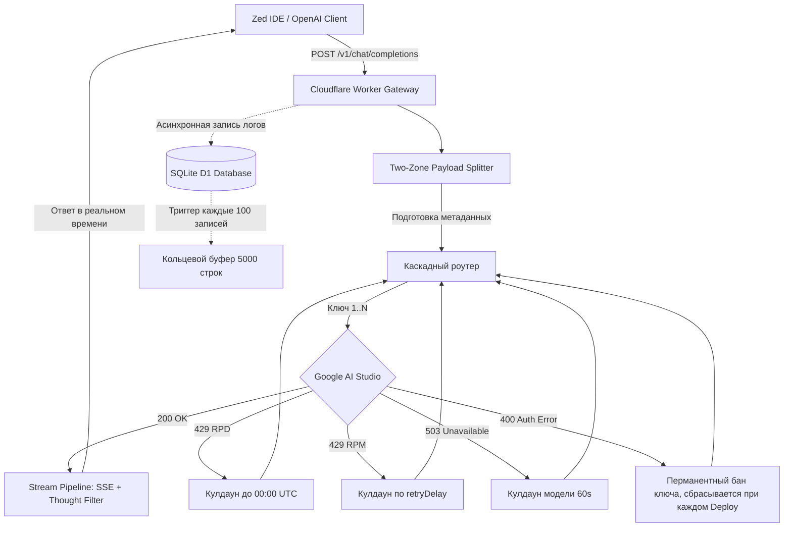

# Gemini Edge Gateway

[](https://github.com/sergeypugin/gemini-edge-gateway/actions)
[](https://gemini-edge-gateway.sergey-pugin080107.workers.dev/)
[](https://workers.cloudflare.com/)
[](https://developers.cloudflare.com/d1/)
[](https://zed.dev)
[](docs/custom_domain.md)
[](CONTRIBUTING.md)


> Для анализа репозитория с помощью ваших LLM можно использовать сжатую версию контекста через сервис Gitingest: https://gitingest.com/sergeypugin/gemini-edge-gateway.

## О проекте

Данный репозиторий - способ в полной мере воспользоваться возможностями [Google AI Studio](https://ai.google.dev) через [Gemini API](https://ai.google.dev/gemini-api).

Ранее я уже писал, как сохранять все свои чаты из Google AI Studio в markdown и как удалять уже ненужные аттачменты из Google Drive - для этого была создана утилита [Google_AI_Studio_Reordering](https://github.com/sergeypugin/Google_AI_Studio_Reordering).

Но вот недавно, скачав редактор Zed (и написав [туториал по работе с ним](https://habr.com/ru/articles/1082090/)), я обнаружил, что куда удобнее при кодинге работать с AI именно внутри этого редактора. Подключив API Key к Zed, я смог воспользоваться AI-агентом для автоматизации многих задач, одна из наиболее трудных была, например, работа с сайтом [itmo-notebook](https://sergeypugin.github.io/itmo-notebook/) ([репозиторий](https://github.com/sergeypugin/itmo-notebook)). И был приятно удивлён! Агент способен с лёгкостью изучить структуру любого проекта, вносить правки, самостоятельно делать коммиты и мёрджить изменения (разумеется, на каждое действие требуется ваше подтверждение). Но в то же время и осталось негативное впечатление: лимиты Google API ничтожны, бесплатные квоты исчерпываются буквально за несколько запросов, а постоянно менять модели или ключи -- уже как-то несерьёзно.

И вот тут уже пора возвращаться к этому проекту. Данный репозиторий представляет собой интеллектуальный отказоустойчивый **Edge-шлюз** на базе **Cloudflare Workers** и **SQLite D1**. Он позволяет использовать ваши бесплатные тарифы Google AI Studio в полной мере и превращает их в самовосстанавливающийся источник для встроенного агента Zed IDE, который может писать код, читать файлы, выполнять команды в терминале и работать с git.

Визуальный стиль веб-дашборда мониторинга вдохновлен проектом [Aspen Search](https://www.aspensearch.com/). На главной странице развернутого воркера ([https://gemini-edge-gateway.sergey-pugin080107.workers.dev/](https://gemini-edge-gateway.sergey-pugin080107.workers.dev/)) отображается полноценный веб-интерфейс: матрица валидации ключей, сводный статус по каждой модели (подробное описание статусов см. в [docs/matrix_statuses.md](docs/matrix_statuses.md)), списки активных моделей и лента логов выполнения в реальном времени.

## Когда этот проект необходим

Репозиторий решает задачу обеспечения бесперебойной работы ИИ-агента в редакторе кода. Плюсы данного решения:
- непрерывная работа над задачами любого рода: агент способен совершать десятки параллельных вызовов инструментов, включая поиск файлов, чтение документации (в том числе чтение сайтов), запуск тестов, применение правок
- нулевые финансовые затраты: объединение пула бесплатных ключей Google AI Studio (максимум 9 независимых проектов) в единый балансировщик с прозрачной ротацией
- защита от сбоев: автоматический каскадный переход между моделями (`gemini-3.8-flash` -> `gemini-3.7-flash` -> `...`) при перегрузках Google (503) или исчерпании квот (429)
- исправление несовместимостей: прозрачное устранение расхождений между спецификацией OpenAI в Zed и Protobuf-адаптером Google
- обеспечение прямой работы без VPN, т.к. шлюз берет на себя сетевое взаимодействие с Google из глобальной сети Cloudflare, избавляя от необходимости держать VPN или локальные прокси включенными на компьютере
> Однако при получении API ключей от Google и взаимодействия с воркером на Cloudflare необходимо использовать VPN. Так что это решение скорее не о том, как работать без VPN, а о том, как обеспечить другим доступ работы без VPN.

> [!note]
> На бесплатном тарифе Google AI Studio действует строгое аппаратное ограничение: **250 000 токенов в минуту (TPM)**. Физический контекст моделей Gemini достигает чуть более 1 млн. токенов, однако отправка запроса объемом более 250k токенов приведет к ошибке `429 Resource Exhausted`.
>
> Для решения проблемы с исчерпанием лимитов воспользуйтесь средством Zed `/compact`.
>
> По [официальной документации Zed Assistant](https://zed.dev/docs/assistant/configuration), редактор непрерывно отслеживает размер диалога и автоматически вызывает команду `/compact` при достижении 90% от лимита контекста. Указав в конфигурации `"max_tokens": 250000`, вы заставляете Zed запускать компактовку на рубеже **225 000 токенов**, что никогда не позволяет запросу превысить лимит 250k TPM. Сама команда -- это отправка вашей дефолтной модели всего чата с просьбой сжать до одного промпта. После её выполнения история чата сохранится, но последующие запросы получат только саму выжимку и сообщения после неё.

> > [!warning]
> [!note]
> Если по каким-либо причинам чат уже достиг 250k токенов и `/compact` не сможет выполниться, то вот единственный рабочий способ восстановить такой чат:
> - найдите в истории диалога свое последнее тяжелое сообщение (или сообщение перед отправкой огромного вывода команды)
> - нажмите на текст сообщения для редактирования, полностью сотрите весь текст и нажмите Enter
> - редактор Zed автоматически удалит ваше пустое сообщение и ответ ассистента на него
> - объем контекста мгновенно уменьшится, после чего команда `/compact` сможет успешно выполниться

## Архитектура шлюза



Более подробные схемы алгоритма санитизации, работы с базой данных D1 и структуры запросов вынесены в отдельный документ: [docs/architecture.md](docs/architecture.md).

Fastpath отдельно запоминает последнюю успешную модель smart/lite и общий последний ключ только в памяти isolate, а не точную пару в D1. Успех фиксируется при принятии первого чанка тела, до завершения стрима. До первого байта действует абсолютный таймаут 60 секунд, после него -- 60 секунд на каждое ожидающее чтение; длительный активный стрим разрешен. Отмена запроса клиентом и сбой уже переданного стрима не замораживают модель. Подробности и различия старых и новых `duration_ms` описаны в [техническом документе](docs/technical.md#таймауты-стрима-и-измерение-duration_ms).

Публичные логи содержат нормализованные сообщения до 160 символов без raw details. Новые `details` в D1 редактируются и ограничены 4 КиБ, а не сохраняются как полный оригинальный дамп; старые строки базы не переписываются.

## Содержание документации

- [Инструкция по развертыванию и настройке](docs/setup_guide.md) -- пошаговый процесс от создания D1 до получения ключей в Google
- [Архитектура и логика работы](docs/architecture.md) -- подробные диаграммы Mermaid, алгоритм Two-Zone Split и обработка ошибок
- [Технические детали](docs/technical.md) -- разбор лимитов subrequests, времени сброса 00:00 UTC и Protobuf-особенностей Google
- [Каталог ответов Google AI API](docs/google_api_responses.md) -- эталонные дампы JSON всех типов ошибок Google
- [Спецификация запросов Zed](docs/zed_payload_spec.md) -- структура полезной нагрузки агента, инструментов и системных промптов
- [Интеграция вне Zed](docs/integrations.md) -- подключение шлюза через cURL, Python, Cursor и консольные утилиты
- [Настройка домена](docs/custom_domain.md) -- прямой доступ к шлюзу из РФ через Custom Domain без использования VPN

## План подключения AI-агента

1. Fork этого репозитория
2. Создание базы данных Cloudflare D1 и сохранение ее ID в секретах GitHub под именем `GATEWAY_D1_ID`
3. Создание Cloudflare API токена с правами на `Workers Scripts` и `D1` и сохранение его в секретах GitHub
4. Выполнение коммита любого изменения в ветку `main` -- GitHub Actions автоматически применит `schema.sql` и развернет шлюз
5. Задайте ключи `GEMINI_KEYS` и пароль доступа `AUTH_SECRET` в переменных Cloudflare
6. Вставка конфигурационного блока в `settings.json` редактора Zed

Полная инструкция со всеми шагами: [docs/setup_guide.md](docs/setup_guide.md).

## Локальная работа и управление SQL D1

Для локального тестирования сайта с подключением к удаленной базе данных D1 и рабочим переменным выполните следующую команду:
```bash
npx wrangler dev --remote
```

Эта команда запустит локальный сервер на http://localhost:8787. В процессе работы создается служебная папка `.wrangler/`, которая уже добавлена в `.gitignore` в этом репозитории.

### Выполнение SQL-запросов к D1

Вы можете просматривать логи и анализировать работу шлюза напрямую через SQL-запросы. Доступны два способа:

1. **Через веб-консоль Cloudflare**:
   В панели Cloudflare перейдите в **Storage & Databases** -> **D1 SQL Database** -> выберите `gemini-gateway-db` -> вкладка **Console**.

2. **Через Wrangler CLI** (локально из терминала проекта):
   ```bash
   npx wrangler d1 execute gemini-gateway-db --remote --command "SELECT model, status, COUNT(*) as count FROM logs GROUP BY model, status;"
   ```

## Pull Requests are Welcome

Приветствуются любые улучшения, исправление багов и расширение функционала шлюза. Пожалуйста, ознакомьтесь с [CONTRIBUTING.md](CONTRIBUTING.md) перед созданием Pull Request.
