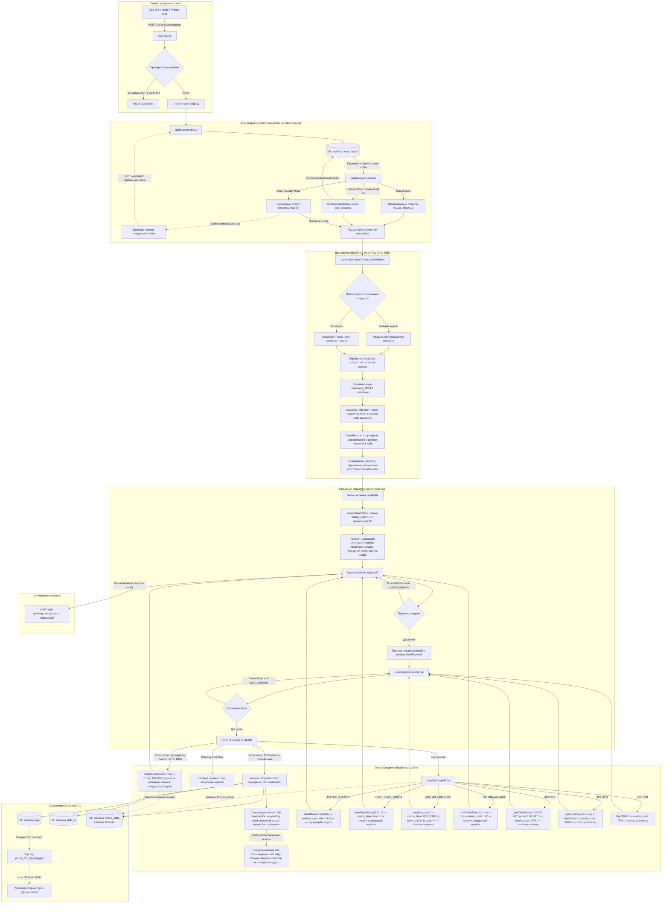

# Архитектура и логика работы шлюза

В данном документе представлена подробная схема работы Gemini Edge Gateway, включая алгоритм проверки и валидации ключей, двухзонную обработку тела запроса (Two-Zone Split), ротацию каскадов, единый источник состояния матрицы `matrix_state` и сохранение логов в базу данных SQLite D1.

## Схема архитектуры



## Fastpath, сигнатуры и граница успеха

Схема показывает логические этапы; в `executeStratifiedRouting` загрузка dead state выполняется до подготовки шаблона. Fastpath независимо приоритизирует `lastSuccessfulSmartModel` или `lastSuccessfulLiteModel` для выбранного каскада и общий `lastSuccessfulKeyId`. После успеха другого каскада ключ может уже не совпадать с ключом, на котором ранее сработала выбранная модель. Это не точная сохраненная пара: модель и ключ должны оставаться среди кандидатов, а блокировки проверяются при переборе.

Эти приоритеты живут только в памяти текущего isolate, не сохраняются в D1 или между deploy и не разделяются глобально между isolate. Для ответа с телом успех фиксируется после принятия первого чанка, а не после полного завершения стрима. Ответ без тела или с немедленным EOF -- исключение, где байтов может не быть. Поздний обрыв не отменяет `Success`, статистику или статус `200`.

`addMissingToolSignatures` сканирует склеенное тело с учетом JSON-строк и экранирования, разбирает только массивы `tool_calls` и сохраняет существующие непустые сигнатуры. В вызовы функций без сигнатуры добавляется `skip_thought_signature_validator`, с сохранением соседних полей. Это fallback совместимости, а не восстановление настоящей подписи или состояния рассуждений; корневые объявления `tools` этим обработчиком не изменяются.

## Таймауты upstream

От запуска fetch до первого чанка действует абсолютный лимит 60 секунд, включая ожидание заголовков. После первого чанка таймер запускается отдельно на каждое ожидающее чтение тела и выключается между чтениями. Длительный активный стрим разрешен. Отмена запроса клиентом не приводит к заморозке модели.

До передачи успешного ответа `TimeoutError` обрабатывается роутером как сбой попытки: модель замораживается на 5 минут и каскад продолжается со следующей моделью. После передачи ответа в SSE-пайплайн обрыв или idle timeout лишь логируется, если запрос клиента не отменен, без бана модели и без повторного запроса. Ответ уже передан клиенту, поэтому сменить upstream прозрачно на этом этапе нельзя.

## Просмотр логов шлюза

### Веб-дашборд

Базовый мониторинг логов и матрица статусов доступны прямо на главной странице воркера в браузере:
`https://gemini-edge-gateway.{ваш_поддомен}.workers.dev/`

Здесь выводятся события, время до первого чанка (`ttfbMs`) и длительность чтения ответа (`responseMs`), задействованные модели, идентификаторы ключей и HTTP-статусы. Неизвестные значения приходят как `null` и отображаются `-`. Публичные сообщения нормализованы до кратких категорий, не превышают 160 символов и не содержат raw details. Поля модели и идентификатора ключа редактируются и ограничиваются 120 символами.

`ttfb_ms` измеряется от начала upstream `fetch`, включая ожидание заголовков, до первого непустого чанка тела. `response_ms` измеряется от этого чанка до EOF тела Google и включает паузы между чанками. Это не время до первого полезного токена и не задержка до отображения ответа в Zed. Успешный лог создаётся при первом байте: `response_ms` сначала `NULL`, затем обновляется в той же строке после EOF. Если тело оборвалось, клиент отменил запрос или байтов не было, неизвестное значение остаётся `NULL`; отдельный warning об обрыве не означает успешного завершения генерации.

Для старых строк `duration_ms` удаляется миграцией без переноса значения в TTFB, так как прежняя метрика измеряла только ожидание заголовков. В `db/schema.sql` хранится исходный v1 baseline; `db/migrations/0001_v1_to_v2_split_log_timings.sql` добавляет новые поля и удаляет старую колонку. GitHub Actions запускает baseline, затем versioned Wrangler migrations перед деплоем; Wrangler хранит журнал применённых миграций в D1.

### Консоль Cloudflare D1 для анализа сохраненных ошибок

Публичная выдача логов не включает `details`. Для просмотра сохраненных диагностических данных выполните прямой SQL-запрос в веб-консоли базы данных Cloudflare D1:

- перейдите в [Cloudflare Dashboard](https://dash.cloudflare.com/)
- в левом боковом меню перейдите: **Storage & Databases** -> **D1 SQL Database**
- выберите базу данных `gemini-gateway-db` (ссылка формата `https://dash.cloudflare.com/{account_id}/workers/d1/databases/{database_id}/console`)
- перейдите на вкладку **Console**

Выполните SQL-запрос для получения последних 100 записей с сохраненными диагностическими данными:

```sql
SELECT timestamp, level, message, model, key_id, status, ttfb_ms, response_ms, details
FROM logs
ORDER BY timestamp DESC
LIMIT 100;
```

Для новых предупреждений и ошибок `message` содержит нормализованную категорию, а `details` -- ограниченный и редактированный снимок `{ message, details }`, а не полный оригинал ответа. `sanitizeErrorDetails` скрывает распознанные секреты и сигнатуры, ограничивает глубину, число элементов и объем строк. Сериализованный JSON ограничен 4096 байтами (4 КиБ); при превышении сохраняется краткий `summary`. Поэтому часть полей квот или `retryDelay` может сохраниться, но полнота дампа и наличие заголовков не гарантируются.

Старые строки D1 не мигрируются и не очищаются новой обработкой: их `message` и `details` могут по-прежнему содержать исходные данные. Нормализация публичной выдачи не меняет содержимое базы.
